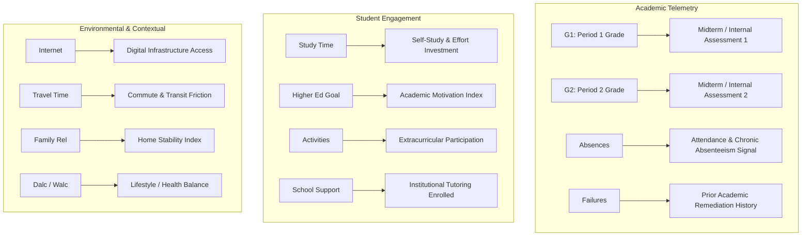

# EduGuard — Dataset Specification & Feature Understanding

## 1. Overview
The primary dataset selected for the MVP is **`data/raw/student-mat.csv`** (Secondary Education Mathematics course, collected by Paulo Cortez and Alice Silva from the University of Minho, Portugal).
A secondary dataset, **`data/raw/student-por.csv`** (Portuguese language course, 649 rows), is archived for future domain extension and cross-course validation. Per design protocol, the two datasets are **not** merged for the MVP to prevent data redundancy and cross-course noise from the 382 overlapping students.

---

## 2. Dataset Dimensions & Quality Inspection

| Property | Value | Notes |
| :--- | :--- | :--- |
| **Row Count** | 395 | 395 distinct student records |
| **Column Count** | 33 | 30 demographic, behavioral & environmental variables + 3 assessment period marks |
| **File Format** | CSV | Semicolon-delimited (`;`), text values enclosed in quotes |
| **Missing Values** | 0 | 0 null, blank, or NaN values across all 33 columns |
| **Duplicates** | 0 | 0 identical duplicate rows |

---

## 3. Data Dictionary & Feature Types

| Column Name | Raw Type | Value Range / Unique Categories | Description |
| :--- | :--- | :--- | :--- |
| `school` | Binary | `'GP'` (Gabriel Pereira), `'MS'` (Mousinho da Silveira) | Student's school |
| `sex` | Binary | `'F'` (Female), `'M'` (Male) | Student's biological sex |
| `age` | Integer | 15 to 22 | Student age in years |
| `address` | Binary | `'U'` (Urban), `'R'` (Rural) | Home address type |
| `famsize` | Binary | `'LE3'` ($\le 3$), `'GT3'` ($> 3$) | Family size category |
| `Pstatus` | Binary | `'T'` (Living together), `'A'` (Apart) | Parents' cohabitation status |
| `Medu` | Ordinal | 0 (none), 1 (4th grade), 2 (5th–9th), 3 (secondary), 4 (higher) | Mother's education level |
| `Fedu` | Ordinal | 0 (none), 1 (4th grade), 2 (5th–9th), 3 (secondary), 4 (higher) | Father's education level |
| `Mjob` | Nominal | `'teacher'`, `'health'`, `'services'`, `'at_home'`, `'other'` | Mother's occupation |
| `Fjob` | Nominal | `'teacher'`, `'health'`, `'services'`, `'at_home'`, `'other'` | Father's occupation |
| `reason` | Nominal | `'home'`, `'reputation'`, `'course'`, `'other'` | Reason for school selection |
| `guardian` | Nominal | `'mother'`, `'father'`, `'other'` | Primary guardian |
| `traveltime` | Ordinal | 1 (<15 min), 2 (15–30 min), 3 (30–60 min), 4 (>60 min) | Commute time to school |
| `studytime` | Ordinal | 1 (<2 hours), 2 (2–5 hours), 3 (5–10 hours), 4 (>10 hours) | Weekly self-study time |
| `failures` | Integer | 0 to 3 | Number of past class failures |
| `schoolsup` | Binary | `'yes'`, `'no'` | Extra educational support from school |
| `famsup` | Binary | `'yes'`, `'no'` | Family educational support |
| `paid` | Binary | `'yes'`, `'no'` | Extra paid tutoring classes |
| `activities` | Binary | `'yes'`, `'no'` | Extra-curricular activities participation |
| `nursery` | Binary | `'yes'`, `'no'` | Attended nursery school |
| `higher` | Binary | `'yes'`, `'no'` | Aspirations to pursue higher education |
| `internet` | Binary | `'yes'`, `'no'` | Internet access at home |
| `romantic` | Binary | `'yes'`, `'no'` | In a romantic relationship |
| `famrel` | Ordinal | 1 (very bad) to 5 (excellent) | Quality of family relationships |
| `freetime` | Ordinal | 1 (very low) to 5 (very high) | Free time after school |
| `goout` | Ordinal | 1 (very low) to 5 (very high) | Going out with friends |
| `Dalc` | Ordinal | 1 (very low) to 5 (very high) | Workday alcohol consumption |
| `Walc` | Ordinal | 1 (very low) to 5 (very high) | Weekend alcohol consumption |
| `health` | Ordinal | 1 (very bad) to 5 (very good) | Current physical health status |
| `absences` | Integer | 0 to 93 | Total days absent from classes |
| `G1` | Numeric | 0 to 20 | First period grade (midterm 1) |
| `G2` | Numeric | 0 to 20 | Second period grade (midterm 2) |
| `G3` | Numeric | 0 to 20 | Final cumulative course grade (**outcome label source**) |

---

## 4. Conceptual Feature Mapping to EduGuard

In EduGuard's higher-education / institutional early warning schema, raw dataset attributes map directly into institutional academic telemetry:



- **Attendance Signal (`absences`)**: Direct continuous indicator of absenteeism. Elevated absence rates directly compromise classroom instructional continuity.
- **Academic Milestone Proxies (`G1`, `G2`)**: Represent midterm evaluation benchmarks. Trend analysis between $G1$ and $G2$ provides valuable momentum metrics (e.g., downward grade velocity).
- **Academic Resilience & Vulnerability (`failures`)**: Historical failure count is one of the strongest predictive indicators of persistent academic disengagement.
- **Engagement & Motivation Proxies (`studytime`, `higher`, `activities`)**: Measure independent effort, academic ambition, and campus integration.
- **Support & Resource Access (`schoolsup`, `famsup`, `paid`, `internet`)**: Captures whether remediation mechanisms are already active or if digital disparity exists.

---

## 5. The Prediction Point & Zero-Leakage Architecture

### Timeline Definition
```
Beginning of Course                               Prediction Point                    Final Exam / Outcome
       |------------------------|------------------------|--------------------------------------|
       t=0                      t=Period 1              t=Period 2                            t=End
                                (G1 released)           (G2 released)                         (G3 recorded)
       [ Demographics, Attendance, Studytime, Failures, G1, G2 Available ]                   [ G3 ONLY ]
```

### Zero-Leakage Principle
1. **Prediction Point Timing**: Predictions are executed immediately following the publication of the second period grades ($G2$), but **before** the final examination or cumulative final grade ($G3$).
2. **Allowed Input Features ($X$)**:
   - Demographic & background features: `school`, `sex`, `age`, `address`, `famsize`, `Pstatus`, `Medu`, `Fedu`, `Mjob`, `Fjob`, `reason`, `guardian`, `traveltime`
   - Engagement & lifestyle features: `studytime`, `failures`, `schoolsup`, `famsup`, `paid`, `activities`, `nursery`, `higher`, `internet`, `romantic`, `famrel`, `freetime`, `goout`, `Dalc`, `Walc`, `health`
   - Attendance & interim grades: `absences`, `G1`, `G2`
   - Engineered features derived exclusively from the above (e.g., grade velocity $\Delta G = G2 - G1$, attendance risk category).
3. **Excluded / Target Field**:
   - `G3` is the final outcome. In Portugal, scores range from $0$ to $20$, where $10$ represents the universal passing grade threshold.
   - **Target Formula**:
     $$\text{at\_risk} = \begin{cases} 1 & \text{if } G3 < 10 \\ 0 & \text{if } G3 \ge 10 \end{cases}$$
   - **Leakage Prevention Guarantee**: `G3` is used solely to construct the binary `at_risk` column during data preprocessing, after which `G3` is strictly deleted from the dataset. It will never be passed to any feature engineering transformer, model training routine, model test split, or backend API request body. Automated unit tests will assert this invariant.

---

## 6. Class Distribution & Imbalance Analysis

Running exact distribution analysis on `data/raw/student-mat.csv`:

| Class | Condition | Count | Percentage | Classification Impact |
| :--- | :--- | :--- | :--- | :--- |
| **0 (Not At Risk)** | $G3 \ge 10$ | 265 | **67.09%** | Majority class |
| **1 (At Risk)** | $G3 < 10$ | 130 | **32.91%** | Minority class (Primary detection target) |
| **Total** | — | 395 | 100.0% | Balanced ~2:1 ratio |

### Evaluation Implications
- A naive baseline classifier predicting all students are "Not At Risk" would achieve $67.09\%$ accuracy while missing $100\%$ of failing students.
- Consequently, accuracy is rejected as the primary metric.
- **Primary Optimization Metrics**:
  - **Recall (Class 1)**: Maximizing detection of at-risk students to minimize false negatives (failing students missed).
  - **F1-Score (Class 1)**: Balancing high recall with acceptable precision to avoid alarm fatigue among faculty.
  - **PR-AUC & ROC-AUC**: Evaluating discriminator ranking performance across decision thresholds.
