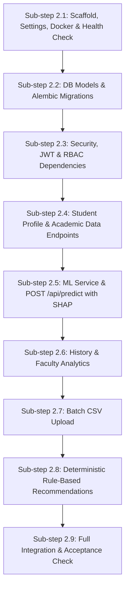

# Phase 2 Plan: FastAPI Backend Service (Revised)

## 1. What We Are Building and Why
In Phase 2, we build the **FastAPI backend service** (`backend/`) for **EduGuard (Explainable AI-Based Early Warning System for Student Academic Risk)**.
- **What**: A modular, secure RESTful API built with FastAPI, Pydantic v2, and SQLAlchemy ORM on top of PostgreSQL, integrating the serialized Phase 1 machine learning pipeline and SHAP explainer.
- **Why**: The machine learning model and SHAP explanations from Phase 1 need a secure API layer with Role-Based Access Control (RBAC), database persistence for student academic histories, deterministic rule-based interventions, and batch CSV processing before the Next.js frontend can connect to it.

---

## 2. Exact List of Files to Create or Modify

We will execute Phase 2 across reviewable sub-steps (pausing for your acceptance between each):

### Sub-step 2.1: Project Scaffold, Minimal App & Health Check
- `backend/requirements.txt` — Pinned backend dependencies (`fastapi`, `uvicorn[standard]`, `pydantic>=2.0`, `pydantic-settings`, `sqlalchemy>=2.0`, `alembic`, `psycopg2-binary`, `python-jose[cryptography]`, `passlib[bcrypt]`, `bcrypt==4.0.1`, `python-multipart`, `pytest`, `httpx`).
- `backend/Dockerfile` — Multi-stage production container build.
- `backend/.env.example` — Environment variable template.
- `backend/app/__init__.py`
- `backend/app/core/__init__.py`
- `backend/app/core/config.py` — Pydantic v2 Settings (database URL, secret keys, token expiration, CORS, artifact paths).
- `backend/app/main.py` — Minimal runnable FastAPI entrypoint with CORS, global exception handlers, and `GET /api/health` health-check route.
- `backend/tests/conftest.py` — Test client fixtures for health check.
- `backend/tests/test_health.py` — Verifies `/api/health` returns status, version, and environment.

### Sub-step 2.2: Database Models & Alembic Migrations
- `backend/app/db/__init__.py`
- `backend/app/db/session.py` — SQLAlchemy 2.0 engine, session factory, `get_db` dependency.
- `backend/app/db/base.py` — Base declarative class registering all models.
- `backend/app/models/__init__.py`
- `backend/app/models/user.py` — `User` table (id, email, hashed_password, full_name, role: student/faculty/admin).
- `backend/app/models/student.py` — `Student` table (id, student_code unique, user_id nullable unique FK to users, demographics).
- `backend/app/models/academic_record.py` — `AcademicRecord` table (id, student_id FK, term/assessment period, timestamp, 32 raw input features; **G3 strictly prohibited**).
- `backend/app/models/prediction.py` — `Prediction` table (id, student_id FK, academic_record_id FK, risk_probability, risk_level, at_risk_binary, model_version, created_at).
- `backend/app/models/explanation.py` — `Explanation` table (id, prediction_id FK, feature_name, display_name, contribution, direction, raw_value).
- `backend/app/models/recommendation.py` — `Recommendation` table (id, student_id FK, prediction_id FK, title, description, category, priority, trigger_condition, created_at).
- `backend/alembic.ini` & `backend/alembic/` — Migration environment and initial schema migration.
- `backend/tests/test_models.py` — Tests model creation, relationships, foreign key cascades, and unique constraints.

### Sub-step 2.3: Security, JWT Authentication & RBAC Dependencies
- `backend/app/core/security.py` — Password hashing with `bcrypt` (12 rounds), constant-time comparison, JWT access token issuance & decoding.
- `backend/app/schemas/auth.py` — Pydantic schemas: `LoginRequest`, `TokenResponse`, `UserRead`, `TokenPayload`.
- `backend/app/api/deps.py` — Authentication & authorization dependencies: `get_current_user`, `require_role(allowed_roles)`, `verify_student_access(student_id)`.
- `backend/app/api/v1/auth.py` — Endpoints: `POST /api/auth/login`, `GET /api/auth/me`.
- `backend/tests/test_auth.py` — Tests password hashing, JWT expiration, invalid credentials, and role enforcement.

### Sub-step 2.4: Student Profile & Academic Data Endpoints
- `backend/app/schemas/student.py` — Pydantic schemas for Student profiles.
- `backend/app/schemas/academic_data.py` — Pydantic validation for the 32 input attributes (grades bounded to $[0, 20]$, absences $\ge 0$, `extra = "forbid"` to reject $G3$).
- `backend/app/api/v1/students.py` — Endpoints:
  - `GET /api/students/{id}`
  - `GET /api/students/{id}/academic-data`
  - `POST /api/students/{id}/academic-data` (faculty/admin only; students cannot write their own telemetry).
- `backend/tests/test_students.py` — Tests CRUD operations and strict cross-student access boundaries (student A cannot view student B -> 403 Forbidden).

### Sub-step 2.5: ML Service Integration & Prediction Endpoint
- `backend/app/services/ml_service.py` — Singleton ML service loading `model_v1.joblib`, `model_metadata.json`, and `EduGuardExplainer` during app startup with graceful error handling if artifacts are missing.
- `backend/app/schemas/prediction.py` — Request/response schemas for `/api/predict` (risk level, risk probability, binary label, top factors, causal disclaimer).
- `backend/app/api/v1/predict.py` — `POST /api/predict`: Evaluates student, computes SHAP attributions, persists `Prediction` and `Explanation` records in PostgreSQL, returns explanation payload.
- `backend/tests/test_predict_endpoint.py` — Verifies prediction output, database persistence, and rejection of $G3$ payloads.

### Sub-step 2.6: Historical Trajectories & Faculty Analytics
- `backend/app/schemas/analytics.py` — Aggregate distribution and analytics schemas.
- `backend/app/api/v1/faculty.py` — Endpoints (faculty/admin only):
  - `GET /api/faculty/students` (paginated student list with latest risk level and score).
  - `GET /api/faculty/analytics` (cohort risk distribution, average grades, chronic absenteeism rate).
- `backend/app/api/v1/students.py` — Endpoint:
  - `GET /api/students/{id}/history` (chronological append-only list of past predictions, grades, and risk trajectories).
- `backend/tests/test_analytics.py` — Tests cohort aggregation calculations and historical trajectory retrieval.

### Sub-step 2.7: Batch Dataset Upload
- `backend/app/api/v1/dataset.py` — `POST /api/dataset/upload` (faculty/admin only):
  - Accepts multipart CSV files (max 10MB).
  - Validates delimiter (comma or semicolon) and schema (all 32 features present, `student_code` required, $G3$ forbidden).
  - Handles duplicate `student_code` records, upserts student identities, appends new academic records, and batch-scores students with the ML pipeline.
  - Returns detailed summary: `{total_rows, created_students, updated_students, predictions_generated, errors[]}`.
- `backend/tests/test_upload.py` — Tests happy path batch scoring, malformed row rejection, and $G3$ leakage rejection.

### Sub-step 2.8: Deterministic Rule-Based Recommendations Engine
- `backend/app/services/recommendation_service.py` — Pure rule-based advisory engine generating actionable suggestions from student telemetry.
- `backend/app/schemas/recommendation.py` — Pydantic schemas for recommendation items.
- `backend/app/api/v1/recommendations.py` — `GET /api/recommendations/{student_id}`: Returns active guidance for student, linked to latest prediction.
- `backend/tests/test_recommendations.py` — Verifies rule trigger conditions and recommendation persistence.

### Sub-step 2.9: Full Integration, PostgreSQL Verification & Acceptance Check
- Integration test suite combining all endpoints against a live PostgreSQL test container.
- Verification of Alembic migrations running cleanly against PostgreSQL.
- End-to-end user journeys (Student login -> view own data -> view explanation; Faculty login -> upload CSV -> view analytics -> inspect high-risk student).

---

## 3. Detailed Architecture & Design Specifications

### 3.1 Student Identity, Unique Constraints, and CSV Mapping

1. **Student Identifier**:
   - The canonical, immutable identifier is **`student_code`** (`VARCHAR(50)`, unique, indexed), e.g. `STU00001`.
   - The 32 machine learning input features do **not** define identity (demographic/grade collisions are possible).
2. **User vs. Student Relationship**:
   - `User`: Handles authentication (email, hashed password, role).
   - `Student`: Handles institutional profile and telemetry.
   - Linkage: `student.user_id` is a nullable, unique Foreign Key to `users.id`.
     - When a student registers or is provisioned an account, `user_id` is linked.
     - Unenrolled/unregistered students created via batch CSV upload have `user_id = NULL` until an account is claimed.
3. **CSV Upload Mapping Logic**:
   - Every uploaded CSV row **must** include a `student_code` column.
   - **Existing Student**: If `student_code` matches an existing `Student.student_code`, the student profile is preserved and a new `AcademicRecord` is appended to their history.
   - **New Student**: If `student_code` does not exist, a new `Student` row is created, followed by their `AcademicRecord`.
   - **File-Internal Duplicates**: If the same `student_code` appears multiple times within a single uploaded CSV, rows are processed sequentially in file order (each adding an academic record) or flagged as duplicates if timestamps/terms collide.
   - **Invalid Rows**: Missing required fields, out-of-range numerical values (e.g. $G1 > 20$), or rows containing $G3$ are rejected with line-numbered error reports (e.g. `Row 12: Missing 'studytime'`).

---

### 3.2 Authorization & Privacy Matrix

| Endpoint | Method | Allowed Roles | Ownership & Scoping Rule |
| :--- | :---: | :--- | :--- |
| `/api/auth/login` | POST | Public | Authenticates credentials; returns JWT token. |
| `/api/auth/me` | GET | Authenticated | Returns current user profile and linked student ID. |
| `/api/students/{id}` | GET | Student, Faculty, Admin | **Student**: Allowed ONLY if `current_user.student_id == id`. Other IDs return **`403 Forbidden`**.<br>**Faculty/Admin**: Allowed for all students. |
| `/api/students/{id}/academic-data` | GET | Student, Faculty, Admin | **Student**: Own data only (`403 Forbidden` otherwise).<br>**Faculty/Admin**: Allowed. |
| `/api/students/{id}/academic-data` | POST | Faculty, Admin | **Student**: **`403 Forbidden`** (students cannot self-author official academic telemetry).<br>**Faculty/Admin**: Allowed. |
| `/api/students/{id}/history` | GET | Student, Faculty, Admin | **Student**: Own history only (`403 Forbidden` otherwise).<br>**Faculty/Admin**: Allowed. |
| `/api/predict` | POST | Student, Faculty, Admin | **Student**: Can only predict for own `student_id` (`403 Forbidden` otherwise).<br>**Faculty/Admin**: Can evaluate any student or standalone feature payload. |
| `/api/recommendations/{student_id}` | GET | Student, Faculty, Admin | **Student**: Own recommendations only (`403 Forbidden` otherwise).<br>**Faculty/Admin**: Allowed. |
| `/api/faculty/students` | GET | Faculty, Admin | **Student**: **`403 Forbidden`**.<br>**Faculty/Admin**: Returns paginated cohort risk list. |
| `/api/faculty/analytics` | GET | Faculty, Admin | **Student**: **`403 Forbidden`**.<br>**Faculty/Admin**: Returns aggregate class distributions. |
| `/api/dataset/upload` | POST | Faculty, Admin | **Student**: **`403 Forbidden`**.<br>**Faculty/Admin**: Allowed for bulk enrollment and scoring. |

---

### 3.3 Prediction & Academic Record Relationships

```
+---------------+        1:N        +------------------+        1:N        +----------------+
|    Student    | ----------------> |  AcademicRecord  | ----------------> |   Prediction   |
| (student_code)|                   | (32 ML features) |                   |  (risk, prob)  |
+---------------+                   +------------------+                   +----------------+
                                                                                   |
                                                          +------------------------+------------------------+
                                                          | 1:N                                             | 1:N
                                                  +----------------+                               +------------------+
                                                  |  Explanation   |                               |  Recommendation  |
                                                  | (SHAP factors) |                               | (advisory rules) |
                                                  +----------------+                               +------------------+
```

1. **Foreign Key Linkage**:
   - Each `Prediction` has an explicit `student_id` (FK to `students.id`) and an `academic_record_id` (FK to `academic_records.id`, nullable if predicting on an ad-hoc unpersisted payload).
2. **Prediction Storage Schema**:
   - `id`: Integer or UUID primary key.
   - `student_id`: Integer FK.
   - `academic_record_id`: Integer FK (nullable).
   - `risk_probability`: `FLOAT` (e.g. 0.8421).
   - `risk_level`: `VARCHAR(10)` ("Low", "Medium", "High").
   - `at_risk_binary`: `INTEGER` (0 or 1).
   - `model_version`: `VARCHAR(20)` (e.g. "v1.0.0").
   - `created_at`: `TIMESTAMP WITH TIME ZONE` (UTC).
3. **Immutability of Predictions (No Overwrite)**:
   - Repeated predictions for a student do **NOT** overwrite existing records.
   - Every inference creates an append-only `Prediction` entry with timestamp.
   - A student's trajectory is the chronological sequence of these immutable predictions.

---

### 3.4 Risk Thresholds & Dual Metric Outputs

The backend strictly preserves the centralized thresholds established in Phase 1 ([ml/artifacts/model_metadata.json](file:///c:/Users/Supriya%20Mallikarjuna/OneDrive/Desktop/EduGaurd/ml/artifacts/model_metadata.json)):

| Output Dimension | Value Range | Label / Value | Operational Purpose & Intended Use |
| :--- | :---: | :---: | :--- |
| **Risk Category** | $0.00 \le P < 0.40$<br>$0.40 \le P < 0.70$<br>$0.70 \le P \le 1.00$ | **Low**<br>**Medium**<br>**High** | **Human Advisory Triage**: The primary display indicator on student and faculty dashboards. Categorizes urgency into actionable bands (High = immediate counseling; Medium = proactive advisor check-in; Low = routine monitoring). |
| **Binary Classification** | $P \ge 0.50$<br>$P < 0.50$ | **1 (At Risk)**<br>**0 (Not At Risk)** | **Statistical Benchmark Evaluation**: Used for formal model performance tracking, confusion matrix logging, and false positive / false negative rate accounting against the passing mark ($G3 < 10$). |

---

### 3.5 Rule-Based Advisory Recommendations

1. **Nature of Recommendations**:
   - Recommendations are **project-defined heuristic guidance**, NOT clinically, psychologically, or educationally certified rules.
   - They provide consultative suggestions for faculty review, **never compulsory automated actions or punitive measures**.
2. **Deterministic Trigger Logic**:
   - **Academic Tutoring**: Triggered if $G2 < 10$ or $\Delta G < -2$ ("Midterm Grade Coaching: Schedule review of core concepts before finals").
   - **Attendance Check-in**: Triggered if $\text{absences} \ge 10$ ("Attendance Advising: Conduct check-in to identify commute or health hurdles").
   - **Remediation Plan**: Triggered if $\text{failures} \ge 1$ ("Foundational Skills Review: Provide targeted problem sets for prerequisite gaps").
   - **Study Skills Workshop**: Triggered if $\text{studytime} \le 1$ ($<2$ hrs/week) ("Time Management: Recommend study habit coaching and peer study groups").
   - **Career & Motivation Counseling**: Triggered if $\text{higher} = \text{'no'}$ ("Aspirations Exploration: Advisor dialogue on long-term educational goals").
3. **Storage & Refresh**:
   - Recommendations are generated upon prediction and persisted in `recommendations` linked to `student_id` and `prediction_id`.
   - When a new prediction is requested, fresh recommendations reflecting the updated telemetry are saved.

---

### 3.6 Model Loading, Startup Behavior & Compatibility

1. **Startup Lifecycle (`@asynccontextmanager`)**:
   - On application startup, `MLService` attempts to load:
     - Model: `ml/artifacts/model_v1.joblib`
     - Metadata: `ml/artifacts/model_metadata.json`
     - SHAP Explainer: `EduGuardExplainer(trained_pipeline=pipeline)`
   - **Compatibility Checks**: Verifies that the serialized `scikit_learn_version` in metadata is compatible with the running runtime.
2. **Missing Artifacts / Startup Failure**:
   - If artifacts are missing or corrupted, the system logs an explicit error and sets `MLService.is_ready = False`.
   - The `GET /api/health` endpoint reports `{"status": "degraded", "model_loaded": false}`.
   - Calls to `POST /api/predict` return a clean **`503 Service Unavailable`** with an actionable message: `"ML model artifacts not loaded. Ensure Phase 1 serialization has run."` (preventing unhandled 500 crashes).
3. **Inference Performance**:
   - Sub-50ms inference is defined as a **measurable engineering target** to be profiled and validated in Sub-step 2.9, rather than an unverified assumption.

---

### 3.7 Security, Secret Management & Upload Safeguards

1. **Secret Management**:
   - All sensitive settings (`SECRET_KEY`, `DATABASE_URL`) are read via environment variables using Pydantic `BaseSettings`.
   - `.env` is ignored by Git; `.env.example` provides non-sensitive defaults.
2. **JWT Security**:
   - Tokens signed with `HS256`, expiring after 480 minutes (configurable).
   - Subject claim (`sub`) stores user ID; claims include role and expiration (`exp`).
   - Expired or tampered tokens return **`401 Unauthorized`**.
3. **Login Security**:
   - Passwords hashed using `bcrypt` (12 rounds).
   - Failed logins return a constant-time generic message (`"Invalid email or password"`) to prevent username enumeration.
4. **File Upload Security**:
   - File extension must be `.csv`; MIME type must be `text/csv` or `text/plain`.
   - Maximum upload size enforced at 10MB to prevent denial-of-service memory exhaustion.
   - Input rows are parsed in streaming chunks and validated against the Pydantic schema before committing to the database.

---

### 3.8 Database Testing Strategy

1. **SQLite In-Memory (`sqlite:///:memory:`)**:
   - Used for rapid, isolated unit testing of authentication, Pydantic validation, authorization boundaries, prediction endpoints, and recommendation logic.
2. **PostgreSQL Integration Testing**:
   - Executed against the local PostgreSQL container (`eduguard-postgres`).
   - Specifically tests:
     - Alembic migration scripts (`alembic upgrade head` and downgrade).
     - Unique constraint enforcement on `users.email` and `students.student_code`.
     - Foreign key cascade deletions (e.g. deleting a student cascades to academic records, predictions, explanations).
     - Concurrent transactions and rollback behavior during CSV bulk uploads.

---

## 4. Sub-Step Implementation Sequence



- **Sub-step 2.1**: Project scaffold, Dockerfile, `.env.example`, settings, minimal FastAPI app with `GET /api/health`, and initial pytest setup.
- **Sub-step 2.2**: SQLAlchemy ORM models, relationships, and Alembic migrations.
- **Sub-step 2.3**: Security, password hashing, JWT authentication (`/api/auth/login`, `/api/auth/me`), and role-guard dependencies.
- **Sub-step 2.4**: Student endpoints (`GET /api/students/{id}`, `GET/POST /api/students/{id}/academic-data`) with strict student-level authorization boundaries.
- **Sub-step 2.5**: ML integration (`POST /api/predict`) connecting Phase 1 model and SHAP explainer with database persistence.
- **Sub-step 2.6**: Historical trajectories (`GET /api/students/{id}/history`) & Faculty analytics (`GET /api/faculty/students`, `GET /api/faculty/analytics`).
- **Sub-step 2.7**: Batch CSV upload endpoint (`POST /api/dataset/upload` with validation and bulk prediction).
- **Sub-step 2.8**: Deterministic rule-based recommendations engine (`GET /api/recommendations/{student_id}`).
- **Sub-step 2.9**: Backend test suite (`backend/tests/`) covering auth, cross-student authorization, prediction shapes, validation rejection, CSV upload, and acceptance check.

---

## 5. Assumptions, Unresolved Decisions & Open Questions

1. **Student Code in Uploaded CSVs**:
   - *Assumption*: The uploaded CSV must contain a `student_code` column header. If the raw UCI dataset (which lacks student IDs) is uploaded directly, should the backend automatically generate sequential IDs (e.g. `UCI_001`, `UCI_002`) or require the user to provide a CSV with an explicit `student_code` column? (We propose accepting an optional `student_code` column, defaulting to auto-generated `STU{row_index:05d}` if omitted).
2. **Faculty Institutional Scoping**:
   - *Assumption*: For the MVP, faculty and admin users have cohort-wide visibility across all enrolled students. Course-specific or departmental multi-tenant isolation is documented for future expansion.
3. **Database Migration on Deployment**:
   - *Assumption*: Alembic migrations are executed as an explicit pre-start command (`alembic upgrade head`) or entrypoint script rather than running automatically inside application runtime code.
4. **Research Prototype Notice**:
   - All backend API responses for `/api/predict` and `/api/recommendations` will include a `"disclaimer"` field explicitly stating that the system is an experimental early-warning prototype and requires human advisor review.
